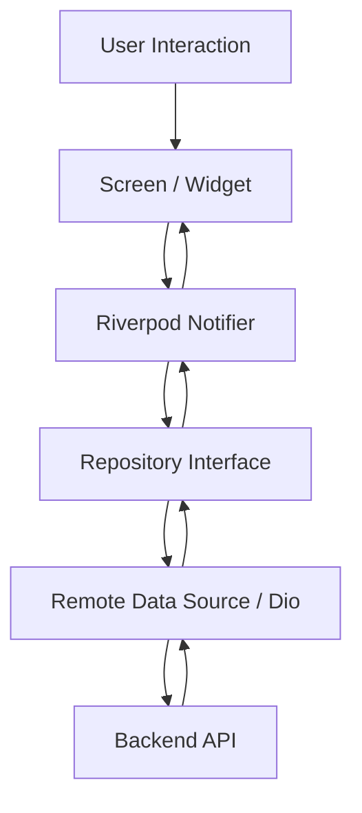
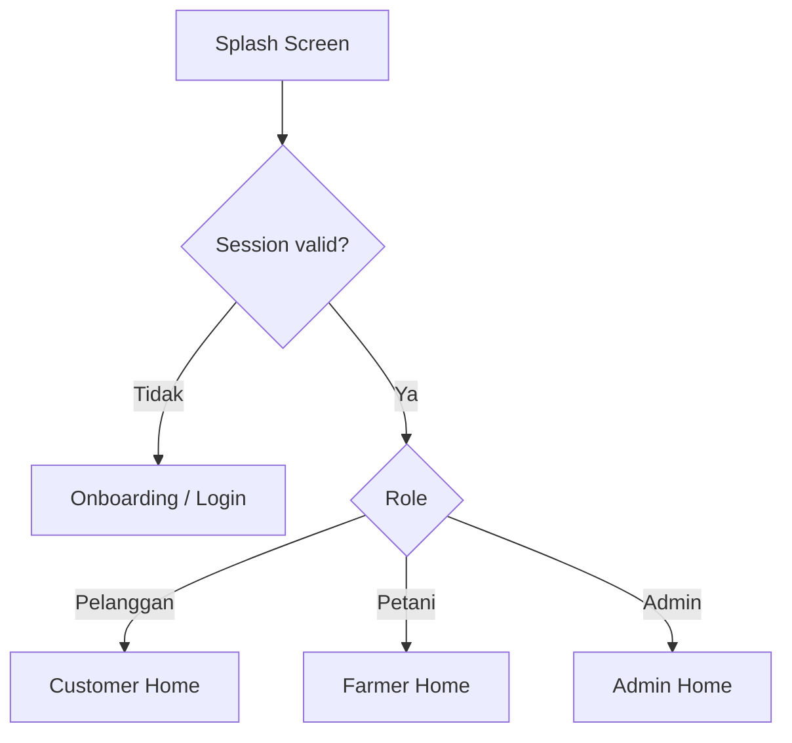
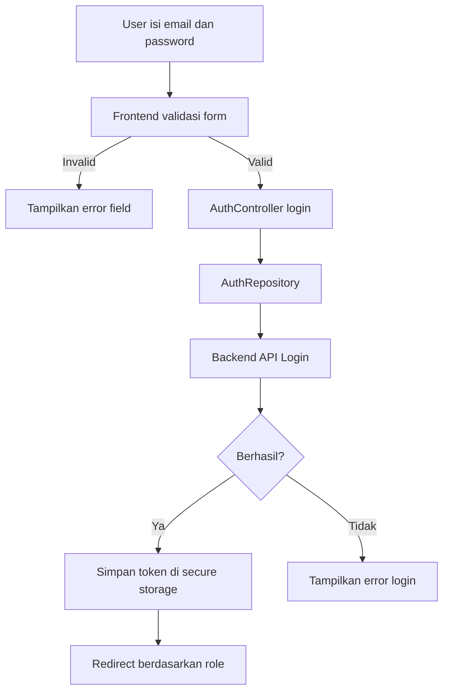
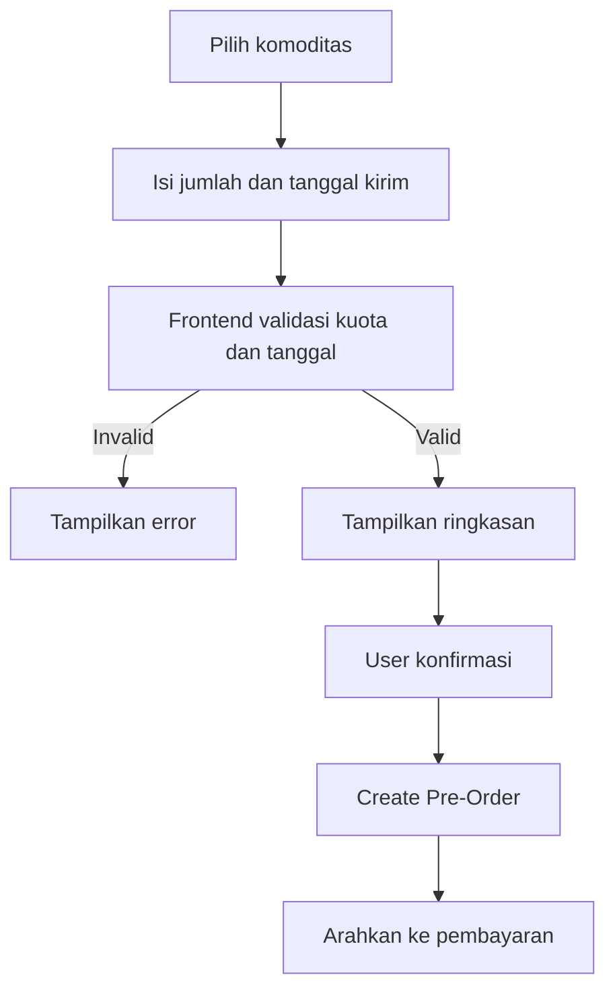
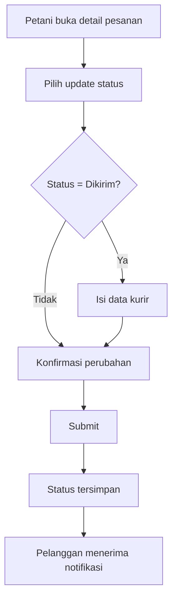
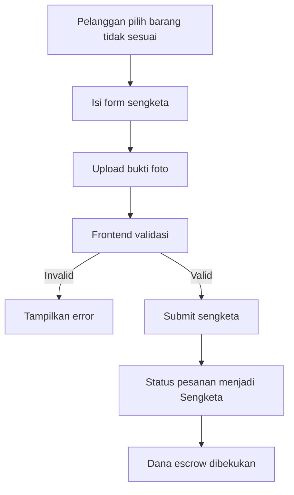
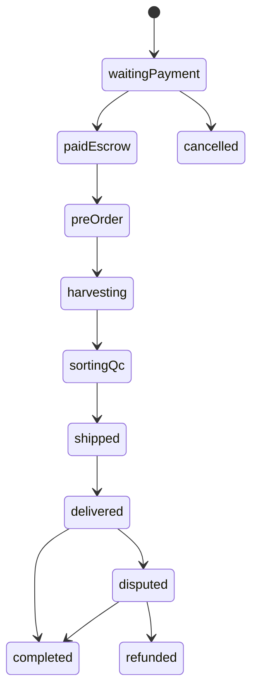

# PanenHub - Blueprint Frontend Android Flutter

**Nama proyek:** PanenHub  
**Jenis produk:** Aplikasi Android rantai pasok pertanian B2B  
**Platform target:** Android mobile application, bukan website  
**Stack utama:** Flutter SDK + Dart  
**Fokus dokumen:** Frontend Android untuk seluruh alur proyek PanenHub  
**Basis rancangan:** Laporan Rancangan Projek RPL Kelompok 3  
**Status dokumen:** Blueprint implementasi frontend

---

## 1. Ringkasan Proyek

PanenHub adalah aplikasi rantai pasok pertanian B2B yang menghubungkan **petani lokal** dengan **pelanggan bisnis kuliner** seperti restoran, katering, dan hotel. Masalah utama yang diselesaikan adalah ketidakpastian pasokan bahan baku segar dan fluktuasi harga melalui fitur **pre-order berbasis masa panen**.

Aplikasi ini memungkinkan pelanggan memesan komoditas sebelum masa panen, membayar melalui mekanisme escrow, memantau status rantai pasok, melakukan konfirmasi penerimaan, melaporkan masalah kualitas, serta memberikan ulasan. Petani dapat mengelola profil lahan, memposting estimasi panen, memproses pesanan, memperbarui status rantai pasok, dan mengajukan pencairan dana. Admin mengelola validasi akun, sengketa, konten, dan pencairan dana.

Dokumen ini hanya membahas **frontend Android berbasis Flutter**. Backend, database fisik, payment gateway, dan storage file tidak dikunci pada dokumen ini karena belum ditentukan secara teknis pada laporan rancangan.

---

## 2. Tujuan Frontend

Frontend PanenHub harus memenuhi tujuan berikut:

1. Menampilkan pengalaman pengguna Android yang profesional, modern, dan konsisten.
2. Mendukung tiga peran utama: **Pelanggan B2B**, **Petani**, dan **Admin**.
3. Mengimplementasikan seluruh alur utama dari laporan rancangan:
   - registrasi dan login,
   - kelola profil dan lahan,
   - posting estimasi panen,
   - pencarian dan filter komoditas,
   - pre-order,
   - pembayaran escrow,
   - update status rantai pasok,
   - konfirmasi penerimaan dan quality control,
   - retur atau sengketa,
   - penyelesaian sengketa,
   - pencairan dana,
   - ulasan dan rating,
   - manajemen pengguna dan konten.
4. Memisahkan UI, state management, business rule ringan, repository, dan akses data.
5. Siap dikembangkan menggunakan mock data terlebih dahulu, lalu dihubungkan ke backend melalui API.

---

## 3. Batasan Scope

### 3.1 Termasuk dalam Scope Frontend

- Aplikasi Android menggunakan Flutter.
- UI dan UX untuk pelanggan, petani, dan admin.
- Routing dan navigasi berbasis role.
- State management aplikasi.
- Validasi form di sisi frontend.
- Integrasi API melalui repository interface.
- Tampilan loading, empty state, error state, dan success state.
- Penyimpanan token/session di perangkat secara aman.
- Mock data untuk kebutuhan demo jika backend belum selesai.
- Struktur folder project frontend.
- Komponen UI reusable.
- Data model Dart.
- Kontrak API awal untuk sinkronisasi dengan tim backend.

### 3.2 Tidak Termasuk dalam Scope Frontend

- Implementasi backend.
- Desain database fisik.
- Payment gateway sebenarnya.
- Sistem escrow riil.
- Panel admin berbasis website.
- Infrastruktur server.
- Deployment ke Play Store.
- Integrasi maps, notifikasi push, atau upload storage produksi jika belum dikonfirmasi.

### 3.3 Keputusan Penting

Karena user menegaskan bahwa aplikasi ini untuk **Android, bukan website**, maka seluruh rancangan frontend pada dokumen ini diarahkan sebagai **mobile app Android**. Admin tetap dirancang sebagai role di dalam aplikasi Android agar seluruh rancangan proyek tetap tercakup. Jika nantinya admin ingin dibuat sebagai web dashboard, maka bagian admin mobile dapat dipindahkan menjadi scope terpisah.

---

## 4. Aktor dan Kebutuhan Utama

## 4.1 Pelanggan B2B

Pelanggan adalah pemilik bisnis kuliner seperti restoran, katering, atau hotel yang membutuhkan bahan baku segar.

### Kebutuhan Pelanggan

- Membuat akun dan login.
- Mencari komoditas berdasarkan jenis, lokasi, dan tanggal panen.
- Melihat detail komoditas dan profil petani.
- Membuat pre-order.
- Melakukan pembayaran escrow.
- Memantau status pesanan.
- Mengonfirmasi penerimaan barang.
- Melaporkan kualitas barang jika tidak sesuai.
- Mengajukan retur atau sengketa.
- Memberikan ulasan dan rating.

---

## 4.2 Petani

Petani adalah mitra yang menyediakan komoditas pertanian.

### Kebutuhan Petani

- Membuat akun dan login.
- Melengkapi profil dan data lahan.
- Memposting estimasi panen.
- Melihat daftar pesanan masuk.
- Memproses pre-order.
- Memperbarui status rantai pasok.
- Mengisi data kurir saat status dikirim.
- Melihat dana tertahan dan dana tersedia.
- Mengajukan withdrawal.
- Melihat ulasan pelanggan.

---

## 4.3 Admin

Admin adalah pengelola sistem PanenHub.

### Kebutuhan Admin

- Login sebagai admin.
- Memvalidasi akun petani.
- Memantau pengguna.
- Memantau transaksi dan status escrow.
- Meninjau sengketa.
- Memvalidasi bukti laporan pelanggan.
- Memutuskan refund atau pencairan dana.
- Menyetujui withdrawal.
- Menghapus atau memblokir konten bermasalah.

---

## 5. Tech Stack Flutter

### 5.1 Core Framework

```yaml
Flutter SDK : ^3.x latest stable
Dart        : ^3.x
Target      : Android
App Type    : Native mobile app built with Flutter
```

Catatan: versi pasti disesuaikan dengan hasil `flutter --version` di perangkat pengembang. Dokumen ini tidak mengunci angka minor/patch agar tetap kompatibel dengan versi stable terbaru yang digunakan tim.

---

### 5.2 Rekomendasi Package Frontend

Package berikut direkomendasikan untuk membuat aplikasi terlihat profesional, maintainable, dan siap integrasi API.

```yaml
dependencies:
  flutter:
    sdk: flutter

  # State management
  flutter_riverpod: ^2.x

  # Routing
  go_router: ^14.x

  # HTTP client
  dio: ^5.x

  # Secure session/token storage
  flutter_secure_storage: ^9.x

  # Local lightweight storage
  shared_preferences: ^2.x

  # Data class and JSON serialization
  freezed_annotation: ^2.x
  json_annotation: ^4.x

  # Image loading and caching
  cached_network_image: ^3.x

  # Image picker for QC/dispute proof
  image_picker: ^1.x

  # Formatting
  intl: ^0.19.x

  # Loading placeholder
  shimmer: ^3.x

  # Icons
  lucide_icons_flutter: ^1.x
```

```yaml
dev_dependencies:
  flutter_test:
    sdk: flutter

  flutter_lints: ^4.x
  build_runner: ^2.x
  freezed: ^2.x
  json_serializable: ^6.x
```

### 5.3 Catatan Package

- `flutter_riverpod` dipilih karena cocok untuk arsitektur modular dan testable.
- `go_router` dipilih karena mendukung routing deklaratif dan route guard.
- `dio` dipilih karena mudah untuk interceptor token, logging, timeout, dan error mapping.
- `flutter_secure_storage` dipakai untuk token login.
- `image_picker` dipakai untuk bukti foto QC atau sengketa.
- Package di atas dapat diganti, tetapi tim frontend harus menjaga pola arsitektur yang sama.

---

## 6. Prinsip Desain Produk Android

Aplikasi PanenHub harus terlihat seperti aplikasi bisnis profesional, bukan prototype kasar.

### 6.1 Karakter UI

- Bersih.
- Modern.
- Mobile-first.
- Minim noise visual.
- Fokus pada transaksi dan status pesanan.
- Menggunakan hierarchy yang jelas.
- Memiliki visual identity yang konsisten.

### 6.2 Gaya Visual

| Elemen | Rekomendasi |
|---|---|
| Primary color | Hijau pertanian profesional |
| Secondary color | Kuning panen / amber |
| Background | Off-white / light neutral |
| Text utama | Dark slate |
| Success | Green |
| Warning | Amber |
| Error | Red |
| Info | Blue |
| Border radius | 12-20 px |
| Card elevation | Rendah, soft shadow |
| Button | Rounded, full-width untuk aksi utama |
| Icon | Line icon modern |
| Layout | Spacing lega, tidak padat |

### 6.3 Token Warna Rekomendasi

```dart
class AppColors {
  static const primary = Color(0xFF2E7D32);
  static const primaryDark = Color(0xFF1B5E20);
  static const primaryLight = Color(0xFFE8F5E9);

  static const secondary = Color(0xFFF9A825);
  static const secondaryLight = Color(0xFFFFF8E1);

  static const background = Color(0xFFFAFAF5);
  static const surface = Color(0xFFFFFFFF);
  static const border = Color(0xFFE0E0E0);

  static const textPrimary = Color(0xFF1F2933);
  static const textSecondary = Color(0xFF6B7280);

  static const success = Color(0xFF2E7D32);
  static const warning = Color(0xFFF59E0B);
  static const error = Color(0xFFD32F2F);
  static const info = Color(0xFF1976D2);
}
```

### 6.4 Tipografi

Gunakan font bawaan Material atau Google Font yang terlihat profesional. Rekomendasi:

- `Inter`
- `Plus Jakarta Sans`
- `Roboto`

Skala tipografi:

| Style | Ukuran | Penggunaan |
|---|---:|---|
| Display | 28-32 | Halaman onboarding |
| Title Large | 22-24 | Judul halaman utama |
| Title Medium | 18-20 | Judul card |
| Body | 14-16 | Konten utama |
| Caption | 11-13 | Metadata, status kecil |

---

## 7. Arsitektur Frontend

### 7.1 Pola Arsitektur

Gunakan pendekatan **feature-first clean architecture ringan**.

Tujuannya:

- mudah dibagi antar anggota frontend,
- mudah dites,
- mudah dihubungkan ke backend,
- tidak membuat semua file menumpuk di satu folder,
- setiap fitur memiliki boundary yang jelas.

### 7.2 Lapisan Arsitektur

```text
Presentation Layer
- Screen
- Widget
- Controller / Notifier
- UI State

Domain Layer
- Entity
- Repository Contract
- Use Case ringan jika diperlukan

Data Layer
- DTO / Model
- Remote Data Source
- Local Data Source
- Repository Implementation
```

### 7.3 Alur Data



### 7.4 Prinsip Teknis

- UI tidak boleh memanggil Dio langsung.
- Screen hanya membaca state dan mengirim intent/action.
- Repository menjadi pintu masuk data.
- Response API harus dimapping ke model/domain.
- Error dari API harus diubah menjadi pesan yang dapat dipahami user.
- Token tidak disimpan di `SharedPreferences`, tetapi di `flutter_secure_storage`.

---

## 8. Struktur Folder Project

```text
lib/
  main.dart
  app/
    app.dart
    router/
      app_router.dart
      route_names.dart
      route_guard.dart
    theme/
      app_theme.dart
      app_colors.dart
      app_text_styles.dart
      app_spacing.dart
    config/
      env.dart
      api_config.dart
  core/
    constants/
      app_constants.dart
      asset_paths.dart
      storage_keys.dart
    errors/
      app_exception.dart
      failure.dart
      error_mapper.dart
    network/
      dio_client.dart
      auth_interceptor.dart
      network_info.dart
    storage/
      secure_storage_service.dart
      local_storage_service.dart
    utils/
      currency_formatter.dart
      date_formatter.dart
      validators.dart
      status_mapper.dart
    widgets/
      app_button.dart
      app_text_field.dart
      app_dropdown.dart
      app_card.dart
      app_status_chip.dart
      app_empty_state.dart
      app_error_state.dart
      app_loading_state.dart
      app_image_picker.dart
      app_confirmation_dialog.dart
  features/
    splash/
      presentation/
        splash_screen.dart
    onboarding/
      presentation/
        onboarding_screen.dart
    auth/
      data/
        auth_remote_data_source.dart
        auth_repository_impl.dart
        models/
          login_request.dart
          register_request.dart
          auth_response.dart
      domain/
        entities/
          app_user.dart
        repositories/
          auth_repository.dart
      presentation/
        controllers/
          auth_controller.dart
          auth_state.dart
        screens/
          login_screen.dart
          register_screen.dart
          role_selection_screen.dart
    home/
      presentation/
        customer_home_shell.dart
        farmer_home_shell.dart
        admin_home_shell.dart
    commodities/
      data/
      domain/
      presentation/
        screens/
          commodity_list_screen.dart
          commodity_detail_screen.dart
          create_commodity_screen.dart
          edit_commodity_screen.dart
        widgets/
          commodity_card.dart
          commodity_filter_sheet.dart
    orders/
      data/
      domain/
      presentation/
        screens/
          order_list_screen.dart
          order_detail_screen.dart
          create_preorder_screen.dart
          update_order_status_screen.dart
        widgets/
          order_status_timeline.dart
          order_summary_card.dart
    payments/
      data/
      domain/
      presentation/
        screens/
          payment_method_screen.dart
          payment_instruction_screen.dart
          escrow_status_screen.dart
    qc/
      data/
      domain/
      presentation/
        screens/
          receive_order_screen.dart
          qc_report_screen.dart
    disputes/
      data/
      domain/
      presentation/
        screens/
          create_dispute_screen.dart
          dispute_detail_screen.dart
          admin_dispute_list_screen.dart
          admin_dispute_review_screen.dart
    withdrawals/
      data/
      domain/
      presentation/
        screens/
          farmer_wallet_screen.dart
          withdrawal_request_screen.dart
          admin_withdrawal_list_screen.dart
    reviews/
      data/
      domain/
      presentation/
        screens/
          create_review_screen.dart
          farmer_reviews_screen.dart
    profile/
      data/
      domain/
      presentation/
        screens/
          profile_screen.dart
          edit_profile_screen.dart
          farmer_land_profile_screen.dart
    admin/
      data/
      domain/
      presentation/
        screens/
          admin_dashboard_screen.dart
          user_verification_screen.dart
          content_moderation_screen.dart
    notifications/
      data/
      domain/
      presentation/
        screens/
          notification_list_screen.dart
```

---

## 9. Navigasi Aplikasi

### 9.1 Alur Global



### 9.2 Route Utama

| Route | Screen | Akses |
|---|---|---|
| `/splash` | Splash | Public |
| `/onboarding` | Onboarding | Public |
| `/login` | Login | Public |
| `/register` | Register | Public |
| `/customer/home` | Customer Home | Pelanggan |
| `/customer/commodities` | Cari Komoditas | Pelanggan |
| `/customer/commodities/:id` | Detail Komoditas | Pelanggan |
| `/customer/preorder/create` | Buat Pre-Order | Pelanggan |
| `/customer/orders` | Pesanan Saya | Pelanggan |
| `/customer/orders/:id` | Detail Pesanan | Pelanggan |
| `/customer/payment/:orderId` | Pembayaran | Pelanggan |
| `/customer/qc/:orderId` | Konfirmasi Penerimaan | Pelanggan |
| `/customer/dispute/create/:orderId` | Ajukan Sengketa | Pelanggan |
| `/customer/review/create/:orderId` | Beri Ulasan | Pelanggan |
| `/farmer/home` | Farmer Dashboard | Petani |
| `/farmer/commodities` | Komoditas Saya | Petani |
| `/farmer/commodities/create` | Posting Estimasi Panen | Petani |
| `/farmer/orders` | Pesanan Masuk | Petani |
| `/farmer/orders/:id/status` | Update Status Pesanan | Petani |
| `/farmer/wallet` | Dompet Petani | Petani |
| `/farmer/withdrawal/create` | Ajukan Pencairan | Petani |
| `/admin/home` | Admin Dashboard | Admin |
| `/admin/users/verification` | Verifikasi User | Admin |
| `/admin/disputes` | Daftar Sengketa | Admin |
| `/admin/disputes/:id/review` | Review Sengketa | Admin |
| `/admin/withdrawals` | Approval Withdrawal | Admin |
| `/admin/content` | Moderasi Konten | Admin |

---

## 10. Bottom Navigation per Role

### 10.1 Pelanggan

| Tab | Fungsi |
|---|---|
| Beranda | Ringkasan komoditas, pesanan aktif, rekomendasi |
| Cari | Pencarian dan filter komoditas |
| Pesanan | Daftar pre-order dan status |
| Notifikasi | Update pembayaran, status, sengketa |
| Profil | Akun bisnis dan pengaturan |

### 10.2 Petani

| Tab | Fungsi |
|---|---|
| Dashboard | Ringkasan pesanan, panen aktif, dana |
| Komoditas | Daftar posting estimasi panen |
| Pesanan | Daftar pesanan masuk |
| Keuangan | Escrow, saldo, withdrawal |
| Profil | Profil petani dan lahan |

### 10.3 Admin

| Tab | Fungsi |
|---|---|
| Dashboard | Ringkasan platform |
| Verifikasi | Verifikasi akun petani |
| Sengketa | Daftar laporan sengketa |
| Konten | Moderasi komoditas dan pengguna |
| Profil | Akun admin |

---

## 11. Data Model Utama

### 11.1 Enum Role

```dart
enum UserRole {
  customer,
  farmer,
  admin,
}
```

### 11.2 Enum Status Pesanan

```dart
enum OrderStatus {
  waitingPayment,
  paidEscrow,
  preOrder,
  harvesting,
  sortingQc,
  shipped,
  delivered,
  completed,
  disputed,
  refunded,
  cancelled,
}
```

### 11.3 Enum Status Sengketa

```dart
enum DisputeStatus {
  submitted,
  underReview,
  approvedRefund,
  rejectedReleaseToFarmer,
  closed,
}
```

### 11.4 AppUser

```dart
class AppUser {
  final String id;
  final String name;
  final String email;
  final String phone;
  final UserRole role;
  final String? avatarUrl;
  final bool isVerified;

  const AppUser({
    required this.id,
    required this.name,
    required this.email,
    required this.phone,
    required this.role,
    this.avatarUrl,
    required this.isVerified,
  });
}
```

### 11.5 FarmerProfile

```dart
class FarmerProfile {
  final String id;
  final String userId;
  final String farmName;
  final String address;
  final double landArea;
  final double? latitude;
  final double? longitude;
  final String verificationStatus;

  const FarmerProfile({
    required this.id,
    required this.userId,
    required this.farmName,
    required this.address,
    required this.landArea,
    this.latitude,
    this.longitude,
    required this.verificationStatus,
  });
}
```

### 11.6 Commodity

```dart
class Commodity {
  final String id;
  final String farmerId;
  final String name;
  final String category;
  final String description;
  final int pricePerKg;
  final double availableQuotaKg;
  final DateTime estimatedHarvestDate;
  final String location;
  final List<String> imageUrls;
  final bool isActive;

  const Commodity({
    required this.id,
    required this.farmerId,
    required this.name,
    required this.category,
    required this.description,
    required this.pricePerKg,
    required this.availableQuotaKg,
    required this.estimatedHarvestDate,
    required this.location,
    required this.imageUrls,
    required this.isActive,
  });
}
```

### 11.7 PreOrder

```dart
class PreOrder {
  final String id;
  final String customerId;
  final String farmerId;
  final String commodityId;
  final double quantityKg;
  final int totalPrice;
  final DateTime deliveryDate;
  final OrderStatus status;
  final String deliveryAddress;
  final DateTime createdAt;

  const PreOrder({
    required this.id,
    required this.customerId,
    required this.farmerId,
    required this.commodityId,
    required this.quantityKg,
    required this.totalPrice,
    required this.deliveryDate,
    required this.status,
    required this.deliveryAddress,
    required this.createdAt,
  });
}
```

### 11.8 Payment

```dart
class Payment {
  final String id;
  final String orderId;
  final int amount;
  final String method;
  final String virtualAccountNumber;
  final String escrowStatus;
  final DateTime? paidAt;

  const Payment({
    required this.id,
    required this.orderId,
    required this.amount,
    required this.method,
    required this.virtualAccountNumber,
    required this.escrowStatus,
    this.paidAt,
  });
}
```

### 11.9 QualityControlReport

```dart
class QualityControlReport {
  final String id;
  final String orderId;
  final bool isAccepted;
  final String? note;
  final List<String> evidenceImageUrls;
  final DateTime createdAt;

  const QualityControlReport({
    required this.id,
    required this.orderId,
    required this.isAccepted,
    this.note,
    required this.evidenceImageUrls,
    required this.createdAt,
  });
}
```

### 11.10 Dispute

```dart
class Dispute {
  final String id;
  final String orderId;
  final String customerId;
  final String reason;
  final String description;
  final List<String> evidenceImageUrls;
  final DisputeStatus status;
  final String? adminDecisionNote;
  final DateTime createdAt;

  const Dispute({
    required this.id,
    required this.orderId,
    required this.customerId,
    required this.reason,
    required this.description,
    required this.evidenceImageUrls,
    required this.status,
    this.adminDecisionNote,
    required this.createdAt,
  });
}
```

### 11.11 Withdrawal

```dart
class Withdrawal {
  final String id;
  final String farmerId;
  final int amount;
  final String bankName;
  final String accountNumber;
  final String accountHolderName;
  final String status;
  final DateTime createdAt;

  const Withdrawal({
    required this.id,
    required this.farmerId,
    required this.amount,
    required this.bankName,
    required this.accountNumber,
    required this.accountHolderName,
    required this.status,
    required this.createdAt,
  });
}
```

### 11.12 Review

```dart
class Review {
  final String id;
  final String orderId;
  final String customerId;
  final String farmerId;
  final int rating;
  final String comment;
  final DateTime createdAt;

  const Review({
    required this.id,
    required this.orderId,
    required this.customerId,
    required this.farmerId,
    required this.rating,
    required this.comment,
    required this.createdAt,
  });
}
```

---

## 12. Screen Specification

## 12.1 Splash Screen

### Tujuan

Menentukan apakah user sudah login dan mengarahkan user ke halaman sesuai role.

### UI

- Logo PanenHub.
- Nama aplikasi.
- Loading indicator kecil.
- Background clean dengan aksen hijau.

### Logic FE

1. Cek token dari secure storage.
2. Jika token tidak ada, masuk ke onboarding/login.
3. Jika token ada, validasi session melalui repository.
4. Jika valid, redirect ke home sesuai role.
5. Jika invalid, hapus token dan redirect ke login.

---

## 12.2 Onboarding Screen

### Tujuan

Memperkenalkan value proposition PanenHub.

### Konten Slide

1. "Pesan hasil panen sebelum panen tiba"
2. "Pantau proses panen, sortir, dan pengiriman"
3. "Pembayaran aman dengan escrow"
4. "Kualitas terjaga melalui QC dan sengketa"

### CTA

- Masuk
- Daftar Sekarang

---

## 12.3 Login Screen

### Field

| Field | Validasi |
|---|---|
| Email | wajib, format email |
| Password | wajib, minimal 6 karakter |

### UI Profesional

- Header singkat.
- Form card.
- Password visibility toggle.
- Button loading saat submit.
- Error message inline.
- Link ke register.

### Alur FE



---

## 12.4 Register Screen

### Field Umum

| Field | Validasi |
|---|---|
| Nama | wajib |
| Email | wajib, format email |
| Nomor HP | wajib |
| Password | wajib, minimal 6 karakter |
| Konfirmasi Password | harus sama |
| Role | pelanggan atau petani |

### Field Tambahan Pelanggan

| Field | Validasi |
|---|---|
| Nama bisnis | wajib |
| Jenis bisnis | restoran/katering/hotel/lainnya |
| Alamat bisnis | wajib |

### Field Tambahan Petani

| Field | Validasi |
|---|---|
| Nama lahan | wajib |
| Alamat lahan | wajib |
| Luas lahan | wajib, numerik |
| Lokasi | opsional jika integrasi maps belum ada |

### Catatan

Admin sebaiknya tidak mendaftar dari aplikasi publik. Akun admin dibuat oleh sistem/backend. Jika untuk demo, admin dapat login menggunakan credential seed.

---

## 12.5 Customer Home Screen

### Tujuan

Memberikan ringkasan cepat untuk pelanggan.

### Komponen

- Greeting user.
- Search bar.
- Shortcut kategori komoditas.
- Card pesanan aktif.
- Rekomendasi komoditas mendekati masa panen.
- Section petani terdekat.
- Banner edukasi escrow.

### Empty State

Jika belum ada pesanan:

> "Belum ada pre-order aktif. Cari komoditas segar dan mulai booking panen."

---

## 12.6 Commodity List Screen

### Tujuan

Pelanggan mencari komoditas berdasarkan jenis, lokasi, dan tanggal panen.

### UI

- Search input.
- Filter bottom sheet.
- Sort dropdown.
- List card komoditas.
- Skeleton loading saat data dimuat.

### Filter

| Filter | Input |
|---|---|
| Kategori | dropdown |
| Lokasi | text/dropdown |
| Tanggal panen | date picker |
| Harga minimum | number |
| Harga maksimum | number |
| Kuota minimum | number |

### Card Komoditas

Menampilkan:

- foto komoditas,
- nama komoditas,
- nama petani,
- lokasi,
- estimasi panen,
- harga per kg,
- kuota tersedia,
- rating petani.

---

## 12.7 Commodity Detail Screen

### Tujuan

Memberikan informasi lengkap sebelum pelanggan membuat pre-order.

### Komponen

- Image carousel.
- Nama komoditas.
- Harga per kg.
- Estimasi panen.
- Kuota tersedia.
- Deskripsi kualitas.
- Lokasi petani.
- Profil singkat petani.
- Ulasan petani.
- CTA: `Buat Pre-Order`.

### Validasi

CTA disabled jika:

- user belum login,
- role bukan pelanggan,
- kuota habis,
- komoditas tidak aktif.

---

## 12.8 Create Pre-Order Screen

### Field

| Field | Validasi |
|---|---|
| Jumlah kg | wajib, lebih dari 0, tidak melebihi kuota |
| Tanggal pengiriman | wajib, tidak boleh sebelum estimasi panen |
| Alamat pengiriman | wajib |
| Catatan | opsional |

### Ringkasan Order

- harga per kg,
- jumlah kg,
- subtotal,
- biaya layanan jika ada,
- total bayar,
- estimasi pengiriman.

### Alur FE



---

## 12.9 Payment Method Screen

### Tujuan

Pelanggan memilih metode pembayaran escrow.

### UI

- Total pembayaran.
- Informasi "dana ditahan sementara sampai barang diterima".
- Pilihan metode pembayaran.
- CTA lanjutkan.

### Catatan

Karena payment gateway belum ditentukan, frontend harus dibuat modular. Untuk demo, payment dapat menggunakan simulasi virtual account.

---

## 12.10 Payment Instruction Screen

### Komponen

- Nomor virtual account.
- Total bayar.
- Batas waktu pembayaran.
- Instruksi transfer.
- Button salin nomor VA.
- Button cek status pembayaran.
- Status badge.

### State

| State | Tampilan |
|---|---|
| Waiting payment | Instruksi pembayaran aktif |
| Paid escrow | Status dibayar, dana tertahan |
| Expired | Tampilkan opsi buat ulang pembayaran |
| Failed | Tampilkan pesan gagal dan retry |

---

## 12.11 Customer Order List Screen

### Tujuan

Menampilkan daftar pesanan pelanggan.

### Tab

- Semua
- Menunggu Bayar
- Dibayar
- Diproses
- Dikirim
- Diterima
- Sengketa
- Selesai

### Card Pesanan

- nomor pesanan,
- nama komoditas,
- petani,
- jumlah,
- total,
- status,
- tanggal pengiriman,
- CTA kontekstual:
  - bayar,
  - lihat detail,
  - konfirmasi penerimaan,
  - ajukan sengketa,
  - beri ulasan.

---

## 12.12 Order Detail Screen

### Komponen

- Informasi pesanan.
- Timeline status rantai pasok.
- Detail komoditas.
- Detail petani/pelanggan sesuai role.
- Informasi pembayaran escrow.
- Informasi pengiriman.
- Riwayat status.
- CTA sesuai status.

### Timeline Status

Urutan tampilan:

1. Pre-Order Dibuat
2. Pembayaran Escrow
3. Menunggu Panen
4. Panen
5. Sortir / QC Petani
6. Dikirim
7. Diterima
8. Selesai

Jika sengketa:

- Status berubah ke `Sengketa`.
- Timeline menampilkan langkah review admin.
- Dana escrow dibekukan.

---

## 12.13 Farmer Dashboard Screen

### Tujuan

Memberikan ringkasan aktivitas petani.

### Komponen

- Greeting.
- Status verifikasi akun.
- Jumlah komoditas aktif.
- Pesanan baru.
- Pesanan perlu update status.
- Saldo tersedia.
- Saldo tertahan escrow.
- Shortcut posting panen.

### Warning

Jika akun petani belum diverifikasi:

> "Akun Anda sedang menunggu verifikasi admin. Beberapa fitur mungkin belum aktif."

---

## 12.14 Farmer Commodity List Screen

### Tujuan

Petani mengelola posting estimasi panen.

### Fitur

- Lihat daftar komoditas.
- Tambah komoditas.
- Edit komoditas.
- Aktif/nonaktifkan posting.
- Lihat kuota tersisa.
- Lihat jumlah pre-order masuk.

---

## 12.15 Create Commodity Screen

### Field

| Field | Validasi |
|---|---|
| Nama komoditas | wajib |
| Kategori | wajib |
| Deskripsi | wajib |
| Harga per kg | wajib, numerik, lebih dari 0 |
| Total kuota kg | wajib, numerik, lebih dari 0 |
| Estimasi tanggal panen | wajib, tanggal masa depan |
| Lokasi/lahan | wajib |
| Foto produk | minimal 1 jika fitur upload aktif |

### UX

- Form dibuat bertahap agar tidak terlalu panjang.
- Gunakan image picker untuk foto produk.
- Tampilkan preview foto.
- Tampilkan ringkasan sebelum submit.

---

## 12.16 Farmer Incoming Orders Screen

### Tujuan

Petani melihat pesanan masuk dari pelanggan.

### Tab

- Baru
- Dibayar
- Panen
- Sortir/QC
- Dikirim
- Selesai
- Sengketa

### CTA

- Lihat detail.
- Update status.
- Hubungi pelanggan jika fitur chat tersedia.
- Lihat bukti pembayaran jika tersedia.

---

## 12.17 Update Order Status Screen

### Status yang Bisa Dipilih Petani

| Status Baru | Syarat |
|---|---|
| Panen | pembayaran sudah escrow |
| Sortir/QC | status sebelumnya Panen |
| Dikirim | status sebelumnya Sortir/QC |
| Selesai | tidak diubah oleh petani, menunggu konfirmasi pelanggan/admin |

### Field Tambahan Saat Dikirim

| Field | Validasi |
|---|---|
| Nama kurir | wajib |
| Nomor resi / nomor kontak kurir | wajib |
| Estimasi tiba | opsional |
| Catatan pengiriman | opsional |

### Alur



---

## 12.18 Receive Order / QC Screen

### Tujuan

Pelanggan mengonfirmasi kondisi barang saat diterima.

### Pilihan

1. Barang sesuai.
2. Barang tidak sesuai.

### Jika Barang Sesuai

- User menekan `Terima Pesanan`.
- Frontend menampilkan dialog konfirmasi.
- Status dikirim ke backend.
- Escrow dicairkan ke petani oleh sistem/backend.
- User diarahkan ke halaman review.

### Jika Barang Tidak Sesuai

- User diarahkan ke form pengajuan sengketa.
- User wajib mengisi alasan dan bukti foto.

---

## 12.19 Create Dispute Screen

### Field

| Field | Validasi |
|---|---|
| Alasan | wajib |
| Deskripsi masalah | wajib, minimal 20 karakter |
| Foto bukti | wajib minimal 1 |
| Jumlah terdampak | opsional |
| Permintaan solusi | refund/retur/penyesuaian |

### Alur



### Catatan Normalisasi

Pada laporan awal terdapat deskripsi use case retur/sengketa yang memakai istilah "hasil kerja" dan "revisi". Pada dokumen frontend ini istilah tersebut dinormalisasi menjadi sengketa kualitas komoditas karena konteks aplikasi adalah rantai pasok pertanian.

---

## 12.20 Admin Dashboard Screen

### Tujuan

Admin melihat ringkasan kondisi platform.

### Komponen

- User menunggu verifikasi.
- Sengketa aktif.
- Withdrawal menunggu approval.
- Total transaksi escrow.
- Komoditas aktif.
- Alert aktivitas berisiko.

---

## 12.21 User Verification Screen

### Tujuan

Admin memvalidasi akun petani.

### Komponen

- List petani pending.
- Detail profil petani.
- Data lahan.
- Dokumen/foto pendukung jika ada.
- CTA setujui.
- CTA tolak dengan alasan.

---

## 12.22 Admin Dispute List Screen

### Tujuan

Admin mengelola laporan sengketa.

### Tab

- Baru
- Dalam Review
- Disetujui Refund
- Ditolak
- Ditutup

### Card

- nomor order,
- nama pelanggan,
- nama petani,
- alasan sengketa,
- tanggal pengajuan,
- status,
- jumlah dana escrow.

---

## 12.23 Admin Dispute Review Screen

### Komponen

- Detail pesanan.
- Deskripsi komplain.
- Foto bukti pelanggan.
- Informasi komoditas.
- Riwayat status.
- Ringkasan escrow.
- Tombol:
  - `Setujui Refund`
  - `Tolak Retur dan Cairkan ke Petani`
  - `Minta Informasi Tambahan` jika fitur ini ditambahkan.

### Validasi FE

Admin wajib mengisi catatan keputusan sebelum submit.

---

## 12.24 Farmer Wallet Screen

### Komponen

- Saldo tersedia.
- Saldo tertahan escrow.
- Riwayat transaksi.
- Riwayat withdrawal.
- CTA ajukan pencairan.

### State Saldo

| Jenis Saldo | Arti |
|---|---|
| Tertahan | Dana pesanan yang belum selesai atau masih sengketa |
| Tersedia | Dana yang bisa ditarik |
| Dalam proses | Withdrawal yang menunggu admin |
| Dicairkan | Withdrawal selesai |

---

## 12.25 Withdrawal Request Screen

### Field

| Field | Validasi |
|---|---|
| Nominal | wajib, tidak melebihi saldo tersedia |
| Nama bank | wajib |
| Nomor rekening | wajib |
| Nama pemilik rekening | wajib |

### Alur

1. Petani mengisi form.
2. Frontend validasi saldo dan field.
3. User konfirmasi.
4. Request dikirim ke backend.
5. Status menjadi `Menunggu Approval Admin`.

---

## 12.26 Review Screen

### Field

| Field | Validasi |
|---|---|
| Rating | wajib, 1-5 |
| Komentar | opsional, maksimal 500 karakter |

### UX

- Star rating besar.
- Text area komentar.
- Ringkasan pesanan.
- CTA kirim ulasan.

---

## 13. Alur Kerja Frontend dan Backend

Dokumen ini tidak membuat backend, tetapi frontend harus disiapkan agar mudah terhubung ke backend. Alur berikut menjadi panduan komunikasi FE-BE.

## 13.1 Prinsip Komunikasi

Frontend:

- menerima input user,
- validasi awal,
- mengelola UI state,
- mengirim request ke API,
- menampilkan hasil,
- menyimpan token/session.

Backend:

- validasi final,
- autentikasi dan otorisasi,
- menyimpan data,
- memproses escrow,
- mengubah status pesanan,
- menyelesaikan sengketa,
- mencairkan dana,
- mengirim notifikasi.

## 13.2 Pola Request

```text
Screen -> Controller/Notifier -> Repository -> RemoteDataSource -> DioClient -> Backend API
```

## 13.3 Pola Response

```text
Backend API -> DioClient -> RemoteDataSource -> Repository -> Controller/Notifier -> UI State -> Screen
```

## 13.4 UI State Standar

```dart
sealed class ViewState<T> {
  const ViewState();
}

class Initial<T> extends ViewState<T> {}

class Loading<T> extends ViewState<T> {}

class Success<T> extends ViewState<T> {
  final T data;
  const Success(this.data);
}

class Empty<T> extends ViewState<T> {}

class Failure<T> extends ViewState<T> {
  final String message;
  const Failure(this.message);
}
```

---

## 14. Kontrak API Awal untuk Tim FE-BE

Kontrak ini bersifat awal. Endpoint final harus disesuaikan dengan backend yang dipilih.

### 14.1 Auth

| Method | Endpoint | Digunakan di FE | Keterangan |
|---|---|---|---|
| POST | `/auth/register` | Register Screen | Daftar pelanggan/petani |
| POST | `/auth/login` | Login Screen | Login dan menerima token |
| POST | `/auth/logout` | Profile Screen | Logout |
| GET | `/auth/me` | Splash/Session | Validasi session aktif |

### 14.2 Commodity

| Method | Endpoint | Digunakan di FE | Keterangan |
|---|---|---|---|
| GET | `/commodities` | Commodity List | Search dan filter |
| GET | `/commodities/{id}` | Commodity Detail | Detail komoditas |
| POST | `/farmer/commodities` | Create Commodity | Petani posting estimasi panen |
| PUT | `/farmer/commodities/{id}` | Edit Commodity | Edit posting |
| PATCH | `/farmer/commodities/{id}/status` | Commodity List | Aktif/nonaktifkan |

### 14.3 Pre-Order

| Method | Endpoint | Digunakan di FE | Keterangan |
|---|---|---|---|
| POST | `/orders` | Create Pre-Order | Membuat pesanan |
| GET | `/orders` | Order List | Daftar pesanan sesuai role |
| GET | `/orders/{id}` | Order Detail | Detail pesanan |
| PATCH | `/orders/{id}/status` | Update Status | Petani update status |

### 14.4 Payment Escrow

| Method | Endpoint | Digunakan di FE | Keterangan |
|---|---|---|---|
| POST | `/orders/{id}/payment` | Payment Method | Generate instruksi bayar |
| GET | `/orders/{id}/payment` | Payment Instruction | Cek status bayar |
| POST | `/payments/{id}/check` | Payment Instruction | Simulasi/cek status pembayaran |

### 14.5 QC dan Penerimaan

| Method | Endpoint | Digunakan di FE | Keterangan |
|---|---|---|---|
| POST | `/orders/{id}/receive` | Receive Order | Konfirmasi barang sesuai |
| POST | `/orders/{id}/qc-report` | QC Report | Laporan kondisi barang |

### 14.6 Sengketa

| Method | Endpoint | Digunakan di FE | Keterangan |
|---|---|---|---|
| POST | `/orders/{id}/disputes` | Create Dispute | Ajukan sengketa |
| GET | `/disputes` | Admin Dispute List | Daftar sengketa |
| GET | `/disputes/{id}` | Dispute Detail | Detail sengketa |
| PATCH | `/admin/disputes/{id}/decision` | Admin Review | Putusan admin |

### 14.7 Withdrawal

| Method | Endpoint | Digunakan di FE | Keterangan |
|---|---|---|---|
| GET | `/farmer/wallet` | Farmer Wallet | Saldo petani |
| POST | `/farmer/withdrawals` | Withdrawal Request | Ajukan pencairan |
| GET | `/admin/withdrawals` | Admin Withdrawal | Daftar approval |
| PATCH | `/admin/withdrawals/{id}` | Admin Withdrawal | Setujui/tolak |

### 14.8 Reviews

| Method | Endpoint | Digunakan di FE | Keterangan |
|---|---|---|---|
| POST | `/orders/{id}/reviews` | Review Screen | Kirim ulasan |
| GET | `/farmers/{id}/reviews` | Farmer Profile | Lihat ulasan |

### 14.9 Admin

| Method | Endpoint | Digunakan di FE | Keterangan |
|---|---|---|---|
| GET | `/admin/users/pending` | User Verification | User menunggu verifikasi |
| PATCH | `/admin/users/{id}/verify` | User Verification | Setujui/tolak user |
| GET | `/admin/contents` | Content Moderation | Daftar konten |
| DELETE | `/admin/contents/{id}` | Content Moderation | Hapus konten |

---

## 15. Repository Contract

### 15.1 AuthRepository

```dart
abstract class AuthRepository {
  Future<AppUser> login({
    required String email,
    required String password,
  });

  Future<AppUser> register(RegisterPayload payload);

  Future<AppUser?> getCurrentUser();

  Future<void> logout();
}
```

### 15.2 CommodityRepository

```dart
abstract class CommodityRepository {
  Future<List<Commodity>> getCommodities(CommodityFilter filter);

  Future<Commodity> getCommodityDetail(String id);

  Future<Commodity> createCommodity(CreateCommodityPayload payload);

  Future<Commodity> updateCommodity(String id, UpdateCommodityPayload payload);

  Future<void> updateCommodityStatus(String id, bool isActive);
}
```

### 15.3 OrderRepository

```dart
abstract class OrderRepository {
  Future<PreOrder> createPreOrder(CreatePreOrderPayload payload);

  Future<List<PreOrder>> getOrders(OrderFilter filter);

  Future<PreOrder> getOrderDetail(String id);

  Future<PreOrder> updateOrderStatus({
    required String orderId,
    required OrderStatus status,
    String? courierName,
    String? trackingNumber,
    String? note,
  });

  Future<void> receiveOrder(String orderId);
}
```

### 15.4 PaymentRepository

```dart
abstract class PaymentRepository {
  Future<Payment> createPayment(String orderId, String method);

  Future<Payment> getPaymentStatus(String orderId);

  Future<Payment> checkPayment(String paymentId);
}
```

### 15.5 DisputeRepository

```dart
abstract class DisputeRepository {
  Future<Dispute> createDispute(CreateDisputePayload payload);

  Future<List<Dispute>> getDisputes(DisputeFilter filter);

  Future<Dispute> getDisputeDetail(String id);

  Future<Dispute> submitAdminDecision({
    required String disputeId,
    required DisputeStatus decision,
    required String note,
  });
}
```

### 15.6 WithdrawalRepository

```dart
abstract class WithdrawalRepository {
  Future<WalletSummary> getWallet();

  Future<Withdrawal> createWithdrawal(CreateWithdrawalPayload payload);

  Future<List<Withdrawal>> getAdminWithdrawals();

  Future<Withdrawal> updateWithdrawalStatus({
    required String withdrawalId,
    required String status,
    required String note,
  });
}
```

---

## 16. State Machine Pesanan

### 16.1 Status Utama

| Status Teknis | Label UI | Aktor yang Mengubah | Keterangan |
|---|---|---|---|
| `waitingPayment` | Menunggu Pembayaran | Sistem | Order dibuat, belum dibayar |
| `paidEscrow` | Dibayar - Dana Ditahan | Sistem | Pembayaran masuk escrow |
| `preOrder` | Pre-Order Aktif | Sistem/Petani | Kuota sudah dibooking |
| `harvesting` | Panen | Petani | Petani mulai panen |
| `sortingQc` | Sortir / QC | Petani | Petani melakukan sortir |
| `shipped` | Dikirim | Petani | Pesanan dikirim |
| `delivered` | Diterima | Pelanggan | Barang tiba |
| `completed` | Selesai | Sistem/Admin | Dana dicairkan ke petani |
| `disputed` | Sengketa | Pelanggan/Sistem | Ada laporan masalah |
| `refunded` | Refund | Admin/Sistem | Dana dikembalikan |
| `cancelled` | Dibatalkan | Sistem/Admin | Order batal |

### 16.2 Aturan Transisi



### 16.3 Aturan FE

- Frontend tidak boleh menampilkan tombol status yang tidak valid.
- Status berikutnya ditentukan berdasarkan status saat ini.
- Untuk status `shipped`, form kurir wajib ditampilkan.
- Untuk status `delivered`, pelanggan harus memilih sesuai atau tidak sesuai.
- Jika `disputed`, tombol review/rating tidak ditampilkan sampai sengketa selesai.

---

## 17. Validasi Frontend

### 17.1 Auth

| Field | Rule |
|---|---|
| Email | required, email format |
| Password | required, min 6 |
| Confirm Password | same as password |

### 17.2 Komoditas

| Field | Rule |
|---|---|
| Nama | required |
| Harga | integer, > 0 |
| Kuota | decimal, > 0 |
| Tanggal panen | future date |
| Deskripsi | required |
| Foto | required jika upload aktif |

### 17.3 Pre-Order

| Field | Rule |
|---|---|
| Jumlah kg | > 0 dan <= kuota |
| Tanggal kirim | >= estimasi tanggal panen |
| Alamat | required |

### 17.4 QC/Sengketa

| Field | Rule |
|---|---|
| Alasan | required |
| Deskripsi | min 20 karakter |
| Bukti foto | minimal 1 |
| Foto | format jpg/png, ukuran mengikuti backend |

### 17.5 Withdrawal

| Field | Rule |
|---|---|
| Nominal | > 0 dan <= saldo tersedia |
| Bank | required |
| Nomor rekening | required, numeric |
| Nama pemilik | required |

---

## 18. Error, Loading, dan Empty State

### 18.1 Loading State

Gunakan:

- skeleton card untuk list,
- button loading saat submit,
- shimmer untuk card komoditas,
- circular progress kecil untuk page transition.

### 18.2 Empty State

Contoh empty state:

| Kondisi | Pesan |
|---|---|
| Tidak ada komoditas | "Belum ada komoditas yang sesuai filter." |
| Tidak ada pesanan | "Belum ada pesanan aktif." |
| Tidak ada sengketa | "Tidak ada sengketa yang perlu ditinjau." |
| Tidak ada withdrawal | "Belum ada riwayat pencairan." |

### 18.3 Error State

Contoh error:

| Kondisi | Pesan |
|---|---|
| Network error | "Koneksi bermasalah. Periksa internet Anda." |
| Unauthorized | "Sesi Anda berakhir. Silakan login kembali." |
| Validation backend | tampilkan pesan field dari backend |
| Server error | "Terjadi gangguan sistem. Coba beberapa saat lagi." |

---

## 19. Komponen UI Reusable

### 19.1 AppButton

Jenis:

- primary,
- secondary,
- outline,
- danger,
- text.

State:

- enabled,
- disabled,
- loading.

### 19.2 AppTextField

Fitur:

- label,
- hint,
- prefix icon,
- suffix icon,
- validation error,
- password toggle,
- keyboard type.

### 19.3 AppStatusChip

Digunakan untuk:

- status pesanan,
- status escrow,
- status verifikasi,
- status withdrawal,
- status sengketa.

### 19.4 AppCard

Digunakan untuk:

- commodity card,
- order card,
- wallet card,
- dashboard summary card.

### 19.5 OrderStatusTimeline

Menampilkan status rantai pasok secara vertikal.

### 19.6 AppImagePicker

Digunakan untuk:

- foto komoditas,
- foto bukti sengketa,
- foto QC.

---

## 20. Desain Halaman agar Terlihat Profesional

### 20.1 Aturan Layout

- Gunakan `SafeArea`.
- Gunakan padding horizontal 16 atau 20.
- Jangan menempelkan konten ke tepi layar.
- Gunakan spacing konsisten: 4, 8, 12, 16, 24, 32.
- Form panjang sebaiknya dibuat multi-section.
- CTA utama diletakkan di bawah atau sticky bottom.
- Jangan terlalu banyak warna dalam satu layar.
- Gunakan card untuk informasi transaksi.

### 20.2 Pola Mobile Profesional

Gunakan pola berikut:

- AppBar sederhana.
- Bottom navigation per role.
- Pull to refresh pada list.
- Filter menggunakan bottom sheet.
- Confirmation dialog untuk aksi penting.
- Snackbar untuk feedback cepat.
- Full screen error untuk error besar.
- Inline error untuk form.
- Timeline untuk status rantai pasok.
- Badge untuk status.

### 20.3 Contoh Copywriting UI

| Kondisi | Copy |
|---|---|
| Escrow info | "Dana Anda ditahan aman sampai pesanan diterima sesuai." |
| QC success | "Pesanan diterima. Dana akan diproses ke petani." |
| Dispute | "Laporkan masalah kualitas dengan bukti foto agar admin dapat meninjau." |
| Farmer status | "Perbarui status agar pelanggan dapat memantau proses panen." |
| Withdrawal | "Dana tersedia dapat ditarik setelah pesanan selesai divalidasi." |

---

## 21. Security Frontend

### 21.1 Token

- Simpan access token di `flutter_secure_storage`.
- Jangan simpan token di plain text.
- Hapus token saat logout.
- Hapus token saat menerima response 401.

### 21.2 Input

- Validasi input di frontend.
- Tetap anggap backend sebagai validasi final.
- Sanitasi teks sebelum ditampilkan jika berasal dari user lain.
- Jangan menampilkan stack trace ke user.

### 21.3 Upload Foto

- Batasi format file.
- Tampilkan preview sebelum upload.
- Kompresi gambar dapat ditambahkan jika ukuran terlalu besar.
- Jangan upload otomatis tanpa konfirmasi user.

### 21.4 Logging

- Jangan log password.
- Jangan log token.
- Jangan log data rekening.
- Logging debug hanya aktif di development.

---

## 22. Mode Mock Data

Karena backend mungkin belum selesai saat frontend mulai dikerjakan, frontend harus mendukung mode mock.

### 22.1 Tujuan Mock Mode

- Membuat UI bisa didemokan.
- Menguji flow role.
- Menguji navigasi.
- Menguji state loading/error.
- Memungkinkan frontend dan backend bekerja paralel.

### 22.2 Cara Implementasi

Gunakan repository abstraction.

```dart
abstract class CommodityRepository {
  Future<List<Commodity>> getCommodities(CommodityFilter filter);
}
```

Implementation:

```text
MockCommodityRepository
RemoteCommodityRepository
```

Di environment development:

```dart
const useMockData = true;
```

Jika backend sudah siap:

```dart
const useMockData = false;
```

---

## 23. Environment Configuration

```dart
class Env {
  static const appName = 'PanenHub';
  static const baseUrl = String.fromEnvironment(
    'BASE_URL',
    defaultValue: 'https://api.panenhub.example',
  );

  static const useMockData = bool.fromEnvironment(
    'USE_MOCK_DATA',
    defaultValue: true,
  );
}
```

Run command contoh:

```bash
flutter run --dart-define=USE_MOCK_DATA=true
```

Saat backend siap:

```bash
flutter run --dart-define=USE_MOCK_DATA=false --dart-define=BASE_URL=https://backend-url
```

---

## 24. Rencana Implementasi Frontend

### Phase 1 - Setup Project

- Buat Flutter project.
- Setup theme.
- Setup routing.
- Setup folder structure.
- Setup Riverpod.
- Setup Dio client.
- Setup secure storage.
- Setup mock repository.

### Phase 2 - Auth dan Role Routing

- Splash.
- Onboarding.
- Login.
- Register.
- Role-based home.
- Logout.

### Phase 3 - Pelanggan

- Customer home.
- List komoditas.
- Filter komoditas.
- Detail komoditas.
- Create pre-order.
- Payment instruction.
- Order list.
- Order detail.
- Receive order.
- Create dispute.
- Create review.

### Phase 4 - Petani

- Farmer dashboard.
- Profile lahan.
- List komoditas petani.
- Create commodity.
- Edit commodity.
- Pesanan masuk.
- Update status rantai pasok.
- Wallet.
- Withdrawal request.

### Phase 5 - Admin Mobile

- Admin dashboard.
- User verification.
- Dispute list.
- Dispute review.
- Withdrawal approval.
- Content moderation.

### Phase 6 - Polishing

- Empty state.
- Error state.
- Loading skeleton.
- Responsive Android screen sizes.
- Form validation.
- UI consistency.
- Testing.
- Bug fixing.

---

## 25. Testing Plan

### 25.1 Unit Test

Target:

- validator,
- formatter,
- status mapper,
- repository mock,
- controller/notifier.

### 25.2 Widget Test

Target:

- login form,
- register form,
- commodity card,
- order card,
- status timeline,
- dispute form,
- withdrawal form.

### 25.3 Integration Test

Flow minimal:

1. Login sebagai pelanggan.
2. Cari komoditas.
3. Buat pre-order.
4. Simulasi pembayaran.
5. Login sebagai petani.
6. Update status sampai dikirim.
7. Login sebagai pelanggan.
8. Konfirmasi penerimaan.
9. Beri ulasan.

Flow sengketa:

1. Pelanggan menerima barang.
2. Pilih barang tidak sesuai.
3. Upload bukti.
4. Ajukan sengketa.
5. Admin review.
6. Admin setujui refund atau tolak.

---

## 26. Definition of Done Frontend

Sebuah fitur dianggap selesai jika:

- UI sesuai design system.
- Layout rapi pada ukuran layar Android umum.
- Ada loading state.
- Ada error state.
- Ada empty state jika relevan.
- Ada validasi form.
- Tidak ada pemanggilan API langsung dari UI.
- Menggunakan repository.
- Role access benar.
- Navigasi benar.
- Tidak ada hardcoded data produksi.
- Dapat berjalan dengan mock data.
- Siap diganti ke remote API.
- Sudah dites secara manual.

---

## 27. Acceptance Criteria per Fitur

### 27.1 Auth

- User bisa login berdasarkan role.
- User diarahkan ke home sesuai role.
- Session tersimpan.
- Logout menghapus session.

### 27.2 Pencarian Komoditas

- User bisa mencari komoditas.
- User bisa filter berdasarkan kategori, lokasi, tanggal, harga, dan kuota.
- Empty state muncul jika tidak ada data.

### 27.3 Pre-Order

- User bisa membuat pre-order dari detail komoditas.
- Kuantitas tidak boleh melebihi kuota.
- Total harga dihitung otomatis.
- Setelah submit, user diarahkan ke pembayaran.

### 27.4 Payment Escrow

- User melihat instruksi bayar.
- User dapat mengecek status pembayaran.
- Setelah paid, status order berubah menjadi dana ditahan.

### 27.5 Update Status Rantai Pasok

- Petani hanya bisa memilih status valid berikutnya.
- Saat status dikirim, data kurir wajib diisi.
- Timeline pelanggan ikut berubah.

### 27.6 QC dan Sengketa

- Pelanggan bisa menerima pesanan jika barang sesuai.
- Jika tidak sesuai, pelanggan wajib mengirim form sengketa dengan bukti foto.
- Status berubah menjadi sengketa.
- Admin dapat memberi keputusan.

### 27.7 Withdrawal

- Petani bisa melihat saldo.
- Petani hanya bisa menarik saldo tersedia.
- Admin dapat menyetujui atau menolak withdrawal.

### 27.8 Review

- Pelanggan bisa memberi rating 1-5 setelah order selesai.
- Review tampil di profil petani.

---

## 28. Checklist UI Profesional

Gunakan checklist ini sebelum demo:

- [ ] App punya splash screen rapi.
- [ ] Warna konsisten.
- [ ] Button tidak berubah-ubah bentuk.
- [ ] Semua form punya label dan error message.
- [ ] Semua list punya loading state.
- [ ] Semua list punya empty state.
- [ ] Semua screen punya padding konsisten.
- [ ] Semua status memakai chip/badge.
- [ ] Timeline status jelas.
- [ ] CTA utama mudah ditemukan.
- [ ] Tidak ada text placeholder seperti "Lorem ipsum".
- [ ] Tidak ada data dummy yang terlihat asal-asalan.
- [ ] Format Rupiah benar.
- [ ] Format tanggal Indonesia benar.
- [ ] Navigasi back konsisten.
- [ ] Role pelanggan tidak bisa membuka halaman petani/admin.
- [ ] Role petani tidak bisa membuka halaman admin.
- [ ] Logout bekerja.
- [ ] Error koneksi ditangani.

---

## 29. Format Data Demo yang Direkomendasikan

### 29.1 Komoditas Demo

```json
{
  "id": "cmd-001",
  "name": "Cabai Merah Keriting",
  "category": "Bumbu",
  "farmerName": "Pak Slamet",
  "location": "Bandungan, Semarang",
  "pricePerKg": 32000,
  "availableQuotaKg": 120,
  "estimatedHarvestDate": "2026-06-15",
  "rating": 4.8
}
```

### 29.2 Order Demo

```json
{
  "id": "ord-001",
  "commodityName": "Cabai Merah Keriting",
  "quantityKg": 25,
  "totalPrice": 800000,
  "status": "paidEscrow",
  "deliveryDate": "2026-06-17"
}
```

### 29.3 Dispute Demo

```json
{
  "id": "dsp-001",
  "orderId": "ord-001",
  "reason": "Sebagian barang busuk",
  "status": "submitted",
  "evidenceCount": 3
}
```

---

## 30. Prioritas MVP

Jika waktu pengerjaan terbatas, gunakan prioritas berikut.

### 30.1 MVP Wajib

- Login/register.
- Role-based home.
- Pencarian komoditas.
- Detail komoditas.
- Buat pre-order.
- Simulasi pembayaran escrow.
- Order detail dengan timeline.
- Petani posting komoditas.
- Petani update status.
- Pelanggan konfirmasi penerimaan.
- Pelanggan ajukan sengketa.
- Admin review sengketa.
- Review/rating.

### 30.2 Bisa Ditunda

- Maps lokasi petani.
- Push notification sungguhan.
- Chat pelanggan-petani.
- Upload dokumen verifikasi kompleks.
- Analytics admin detail.
- Multi-language.
- Dark mode.
- Deep link.
- Play Store release.

---

## 31. Hal yang Perlu Dikonfirmasi Tim

Bagian ini belum boleh dianggap final sebelum dikonfirmasi.

1. Backend akan memakai apa: Laravel, Express/NestJS, Firebase, Supabase, atau lainnya.
2. Apakah admin benar-benar harus ada di Android, atau nanti dibuat dashboard web terpisah.
3. Payment gateway yang dipakai.
4. Apakah escrow hanya simulasi untuk tugas atau harus terintegrasi real.
5. Apakah upload foto memakai local mock, server upload, Cloudinary, Firebase Storage, atau storage lain.
6. Apakah maps lokasi wajib.
7. Apakah push notification wajib.
8. Logo final dan brand guideline.
9. Minimum Android SDK.
10. Apakah aplikasi butuh mode offline.
11. Apakah akun petani harus diverifikasi sebelum bisa posting.
12. Apakah pelanggan juga perlu diverifikasi.
13. Apakah ada biaya layanan platform.
14. Apakah retur barang fisik benar-benar dilakukan atau hanya refund/penyesuaian dana.
15. Apakah withdrawal butuh bukti transfer dari admin.

---

## 32. Kesimpulan

Blueprint ini merangkum rancangan frontend Android PanenHub berbasis Flutter. Fokus utamanya adalah membuat aplikasi mobile yang profesional, modular, mudah dikembangkan, dan sesuai dengan rancangan proyek RPL.

Struktur yang dipakai memisahkan fitur berdasarkan role dan domain. Seluruh alur utama dari laporan telah diterjemahkan ke dalam screen, navigasi, state, repository contract, data model, dan alur komunikasi FE-BE awal.

Dokumen ini dapat langsung digunakan sebagai acuan kerja tim frontend untuk mulai membuat project Flutter Android PanenHub.
